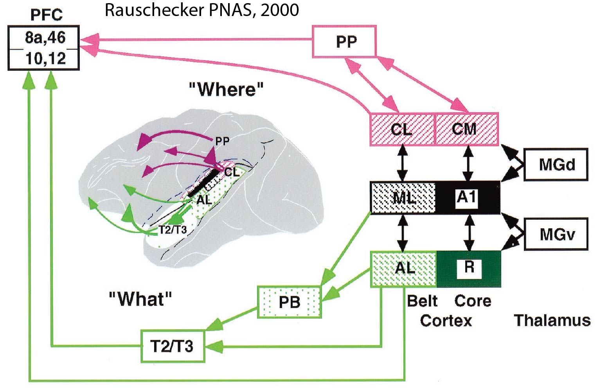
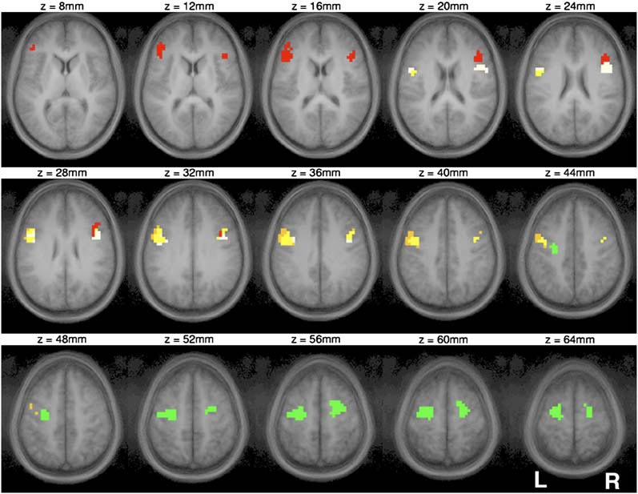
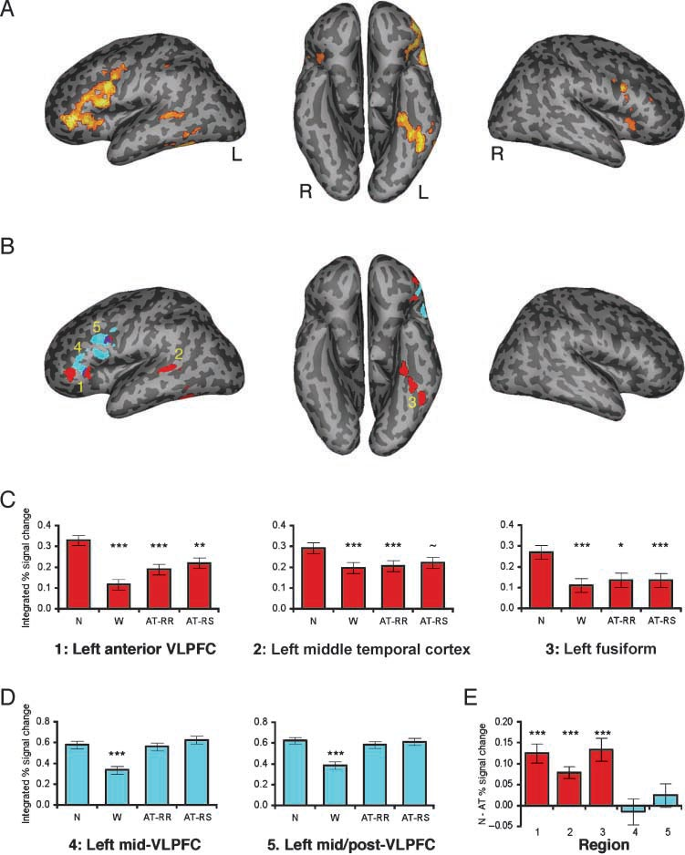
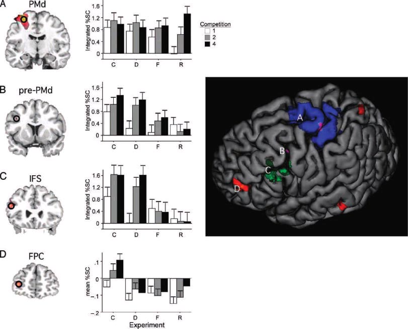
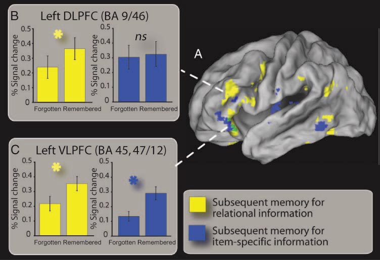

Connecting the dorsal and ventral streams in language and cognitive control
===========================================================================

**How to connect the posterior streams to the anterior streams:**

#. **Anatomically**
#. **Functionally**

*This is the grant idea*

**The specific hypotheses are:**

* auditory/language dorsal-ventral streams continue to dorsal and ventral frontal lobe rather than converging in IFG 

	* there is an anterior component to the dorsal stream

* though the frontal components of these streams subserve high-level, domain-general processes that are utilized on demand in service of top-down control, they nevertheless share core organizing principles with posterior streams

	* both streams are hierarchically organized; the hierarchy is maintained in the PFC 
	* the PFC ventral stream subserves time independent (object or item) processing
	* the PFC dorsal stream subserves time dependent (relational) processing

How would we show this anatomically?
------------------------------------

Resting state and DTI studies honing in on these pathways in the human for dorsal:

.. image:: romanski.jpg

If possible these methods could give us subject -specific dorsal and ventral stream regions

Functionally?
--------------

I am still thinking about this

But the main thrust will be to connect the Schlesewsky theory with current thinking about the frontal rc and dl-vl axis

First lets touch on a few points from the review...

Here are a few things I took from the Bornkessel-Schlesewsky, Schlesewsky, 2013 review:
---------------------------------------------------------------------------------------

Ventral: 
"""""""""

* time independent

* maintains/represents the auditory objects,

* assumes things like syntax are bound to the object to some extent, part of the chunk?

* has a hierarchy, words--> pieces of sentences to sentences

Dorsal:
""""""""""

* time dependent

* does the work of keeping componential (flexible) bindings between the objects

* hierarchy is driven by level of the narrative that needs to be sequenced or unraveled to comprehend

         
**Evidence for a dorsal and ventral streams from the language lit**
----------------------------------------------

Ventral Stream:
"""""""""""""""""
	**Idiom semantic distance and metaphor** : 
		
		figurative > literal metaphors and idioms recruit mid-VLPFC (45-47/12) from Bohrn *neuroimage* , 2013 meta-analysis
		
		literal vs. metaphoric vs. action vs. abstract sentences from Desai et al. 2013:

		.. image:: Table1_desai.jpg		
		
		mid-VLPFC: Idiomatic>Abstract and Literal>Abstract, but abstract was weird
		
		The idea is that the mid-VLPFC involved in retrieval of metaphorical or low imageability sentences
		
		.. image:: fig1_desai.jpg
		
		.. image:: fig2_desai.jpg
		
		Romero Lauro another verb processing paper showing VLPFC
		A) is figurative >literal  
		B) literal > figurative
		C) overlap between for figurative conditions
		
		.. image:: Romero_Lauro.jpg
		
	
	
	**metaphor** : Jie paper
	
	

Dorsal Stream:
"""""""""""""""""

Most of the literature I have found is neuropsych. 

Dynamic Aphasia
	**Alexander, JINS, 2006** : DLPFC lesions, impaired in open-ended narrative discourse
	
High level comprehension
	**Dronkers, Cognition, 2004** : area 46 as well as 47 show significant contribution to subtests in CYCLE R:
		
			A) Active Voice
			B) Double Embedding
			C) Object-Subject Relative
			D) Subject Relatives
			
	.. image:: Dronkers2004_table2.jpg
	.. image:: Dronkers2004_table4.jpg
	
			
			
Story Grammar

Narrative vs. Procedural Discourse Production:

	**Alexander, JINS, 2006** : Narrative discourse is open-ended and procedural discorurse is fairly constrained
	
	**Coelho ngia, 2013**: LDLPFC lesions difficulty in narraitve coherence and inclusion of critical story components.

	The discourse ability was correlated with WM in DLPFC groups
	
	**Discourse compression**: Jie will give me paper
	

		 
**Evidence from the cognitive control lit**
----------------------------------------------
		 
There are a plethora of studies that focus on a single of regions in either ventral or dorsal PFC

These studies are informative, but for our purpose not as informative as those that demonstrate:

* **hierarchical processing**

* **in either dorsal or ventral regions**

Here are a couple of examples:

Ventral Stream:
"""""""""""""""""

**Koechlin & Jubault, 2005** : simple to complex chunks of learned sequences processed in progressively more rostral areas of ventral stream

granted some of the activation looks dorsal, but we have hierarchical build up of objects, but the objects themselves are sequences. This has a natural corollary to language

**Race et al 2009** : priming for very concrete to very abstract, posterior ventrolateral cortex is sensitive to all aspects of the object or trial, anterior is sensitive to only the semantic properties, here we have a build-up of abstractness along the rostrocaudal axis, this is hierarchical as well in that the chunks get larger and more abstract

Dorsal Stream:
"""""""""""""""""

Koechlin et al. 2003: Very complex, design, but it is all about the hierarchy or temporal abstractness of s-r mapping

.. image::	koechlin_science.jpg

Badre & D'Esposito

Blumenfeld's stuff: show that relational but not item drives dorsal but not ventral regions

