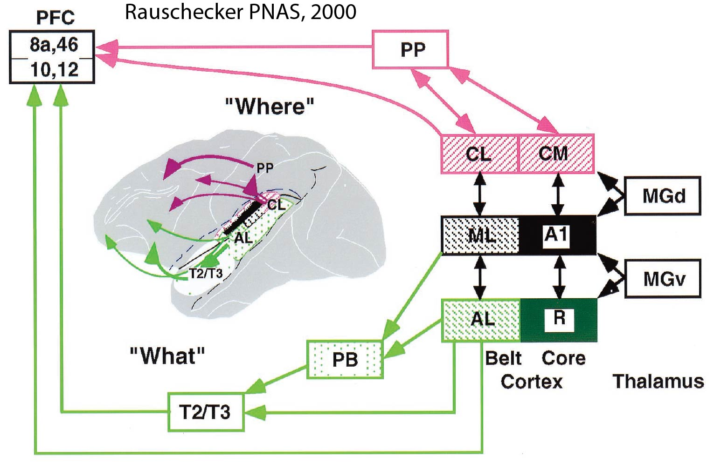

Theories of Dorsal/Ventral Streams in Auditory Language Processing
=====================================================================

Go here for a discussion and summary of the major dorso-ventral language theories:

.. toctree::
   :titlesonly:
   :maxdepth: 1
   
   hickok_poeppel
   friederici
   bornkessel
   

   
   
Review articles:
-----------------------------
   
Here is a list of some reviews articles that deal with the auditory dorsal and ventral streams:

#. `Rauschecker, JP. Parallel processing in the auditory cortex of primates. Audiol Neurootol, 1998. 3: 86-103. PMID: 9575379. <http://www.karger.com/Article/Pdf/13784>`_
#. `Rauschecker, JP, Tian, B. Mechanisms and streams for processing of "what" and "where" in auditory cortex. Proc Natl Acad Sci U S A, 2000. 97: 11800-6. <http://www.pnas.org/content/97/22/11800.full.pdf+html>`_
#. `Romanski, LM, Tian, B, Fritz, J, Mishkin, M, Goldman-Rakic, PS, Rauschecker, JP. Dual streams of auditory afferents target multiple domains in the primate prefrontal cortex. Nat Neurosci, 1999. 2: 1131-6. PMID: 10570492 PMCID: PMC2778291. <http://www.nature.com/neuro/journal/v2/n12/pdf/nn1299_1131.pdf>`_
#. `Hickok, G, Poeppel, D. The cortical organization of speech processing. Nat Rev Neurosci, 2007. 8: 393-402. Epub 2007 Apr 13. PMID: 17431404. <http://www.nature.com/nrn/journal/v8/n5/pdf/nrn2113.pdf>`_
#. `Hickok, G, Poeppel, D. Dorsal and ventral streams: a framework for understanding aspects of the functional anatomy of language. Cognition, 2004. 92: 67-99. PMID: 15037127. <http://www.sciencedirect.com/science/article/pii/S0010027703002282#>`_
#. `Saur, D, Kreher, BW, Schnell, S, Kummerer, D, Kellmeyer, P, Vry, MS, Umarova, R, Musso, M, Glauche, V, Abel, S, Huber, W, Rijntjes, M, Hennig, J, Weiller, C. Ventral and dorsal pathways for language. Proc Natl Acad Sci U S A, 2008. 105: 18035-40. <http://www.pnas.org/content/105/46/18035.full.pdf+html>`_
#. `Friederici, AD. Pathways to language: fiber tracts in the human brain. Trends in Cognitive Sciences, 2009. 13: 175-181. PMID: 19223226. <http://www.sciencedirect.com/science/article/pii/S1364661309000278#>`_
#. `Friederici, AD. The cortical language circuit: from auditory perception to sentence comprehension. Trends in Cognitive Sciences, 2012 <http://www.sciencedirect.com/science/article/pii/S1364661312000794?via=ihub>`_
#. `Bornkessel-Schlesewsky, I, Schlesewsky, M. Reconciling time, space and function: a new dorsal-ventral stream model of sentence comprehension. Brain Lang, 2013. 125: 60-76. Epub 2013 Feb 26. PMID: 23454075. <http://www.sciencedirect.com/science/article/pii/S0093934X13000278>`_
#. `Rilling, J.K. et al. (2008) The evolution of the arcuate fasciculus revealed with comparative DTI. Nat. Neurosci. 11, 426–428 <http://www.nature.com/neuro/journal/v11/n4/pdf/nn2072.pdf>`_

**Here are some figures:**
-----------------------------
This is a nice figure from the Saur et al study. Notice how the dorsal stream does not reach PFC

This is a figure from Rauschecker et al. The PFC connections come from Romanski. 1999, looks to be evidence of a dorsal ventral distinction in PFC

Now taking a look at the Romanski paper, we can see that indeed there is evidence for both a dorsoventral and rostrocaudal gradient of connections between auditory belt areas and PFC

.. image:: romanski.jpg

