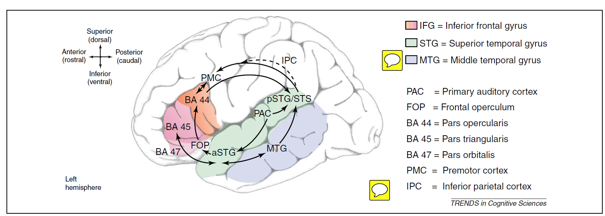

Friederici's (2009, 2012) Dorsal Ventral Theory:
================================================

* **2 Ventral streams:** mapping sounds to meaning (semantics) + local syntax

* **2 Dorsal streams:** mapping sounds to motor + complex semantics in non-canonical word orders

Ventral Network Flowchart:
-------------------------------	
	
* Ventral Network I: Local phrase structure building (syntax)
		
		* Primary Auditory --> aSTG/STS --> FO --> BA44
			
			* via the UF
					
* Ventral Network II: Semantic processing
		
		* Primary Auditory --> MTG --> Temporal Pole --> BA 45 & BA 47
			
			* via the Extreme Capsule (ECSF)

Dorsal Network Flowchart:
----------------------------------

* Dorsal Network I: Sound to motor mapping
	
		* Primary Auditory --> Inf. Parietal --> PMC
			
			* via the SLF
	
* Dorsal Network II: Process hierarchical structures independent of semantics/complex syntax	
	
		* Primary Auditory --> Temporal --> BA 44
			
			* via the Arcuate

			
From Friederici, TICS, 2012:
------------------------------------

			

			
Basic Descriptions of Nodes:
-----------------------------------
	
* Primary Auditory: Phonological form extraction & Perception

* aSTG/STS: Initial stage of synactic processing, phrase structure building and assigning rough syntactic category

* Frontal Operculum: entry point for syntax via aSTG/STS, involved in local phrase structure

* BA 44: Core syntax region, hierarchical processing, re-arrangement of clearly marked non-cannonical sentences

	* Its back projection to temporal cortex: delivers predictions about incoming info to temporal cortex or prediction errors about the failed expectancy

* pSTG/STS + Angular gyrus: high vs low predictability contexts (??)

* MTG: lexical-semantic processing

* Temporal Pole: word-level and probably sentential syntax

* BA 45: semantics + syntax (possibly), when harder syntax posterior BA45

* BA 47: top-down semantics

* Posterior temporal: syntactic/semantic integration
				

				
Comments and Discussion:
----------------------------

A lot of the article is concerned with ventral network.

Syntax is broken down into local and complex syntactic processing, according to this model, different streams more ore less handle different types of syntax

A big psychological factor is dealing with non-cannonical word order. This is the entire job of the Dorsal stream and what separates local from complex syntax

There is no handling above the word level though really

Presume that anterior temporal cortex is sentential syntax as well as high-level semantics

The dorsal stream back projection from IFG to temporal cortex is an interesting feature of this model

Argues for a multipartite organization of BA 44 based on fMRI findings, this is not very anatomically valid

I think according to this model, complex sentences are always processed in a top-down manner

