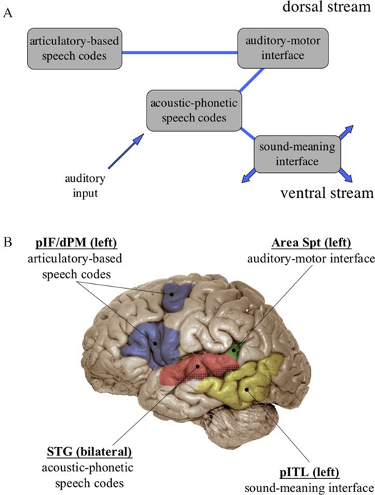
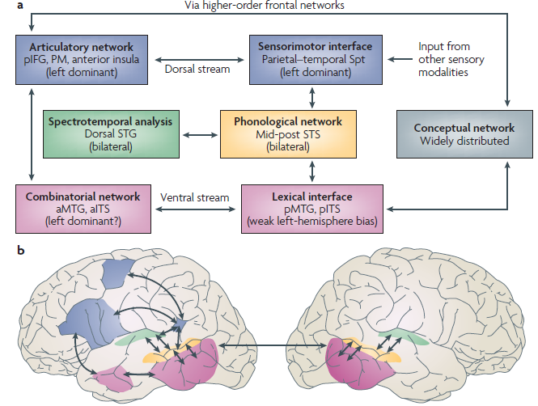

Hickok & Poeppel (2004, 2007) Theory
===================================

**Ventral:** mapping sounds to meaning

**Dorsal:** mapping sounds to articulation, sensory-motor integration

Dorsal Stream:
-------------------

* According to this view the dorsal stream is *not perceptual* but solely involved in auditory sensory-motor integration

* Area SpT: auditory-motor interface: coordinate transformation mapping bw auditory stimulus and speech

	* seems to be functionally defined (reverse inference)

* Dorsal Pre-motor: articulatory-based speech codes

* Areas of IFG: Seemingly the same as PMD, does not differentiate function

	* also: says that the precise ventral PFC can change with task (also functionally defined)

* Says that Dorsal Stream more lateralized than ventral

* Will get Dorsal activity in perception task if subject uses *articulatory re-mapping* (but what is this?)

* In 2007 view, dorsal stream is involved in **speech perception** but not recognition

Ventral Stream:
-----------------------

* Not involved in motor, just comprehension and semantics

* Area STG: contains acoustic-phonetic speech codes

* Area called pITL: sound-meaning interface, also functionally defined

* Does not seem to require PFC, but at the end leaves room for it

* In 2004, speculates that grammar is in the ventral stream, but really has no idea

* In 2007 says this again that dorsal represents grammatical features

Additions with 2007 paper:
---------------------------

Beyond those mentioned above here are some noteworthy points in the 2007 paper:

* all connections are bidirectional (in contrast to Federici)

* Anterior Temporal Lobe: high-level semantic-phonological and grammar too, but this is not well worked out

Comments:
--------------

* Many areas are functionally defined, which makes this account very phrenological and hard to test due to reverse inference

* Seems really to just be about single words

* Does not account for and can not handle grammar or words in context, if so they punt and say its ventral

* Very vague in terms of what PFC does, speech codes?

* Hand wavy explanation for dorsal perception effects

* Here is their way of trying to accommodate grammar:

	* "However, it is unclear whether the neural computations that underlie speech recognition in particular involve each of these processing levels, and whether the levels involved are serially organized and immutably applied or involve parallel computational pathways and allow for some flexibility in processing

* Saur *(Saur et al., PNAS 2008)* basically re-casts this theory using a bit more speciifc neuroanatomy

Hickok & Poeppel (2004) Model:
---------------------------------

Hickok & Poeppel (2007) Model:
---------------------------------

