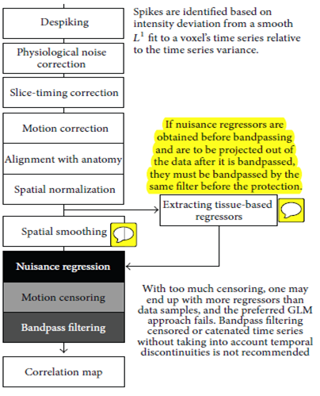

Jo AFNI 2013 resting state method
==================================
.. _JO CORRELATION:

Resting state pipeline that deals with the issue of spatial dependence of correlation without resorting to scrubbing
One major point is to not remove global signals

They also suggest a specific order of operations
	
	**BUT** strangely enough they appear to have a typo in that smoothing comes before nuissance regression, but you would not want to run things in this order

